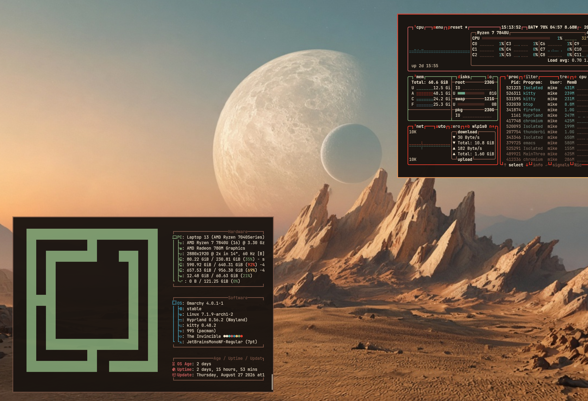

# The Invincible — Omarchy Theme

An [Omarchy](https://omarchy.org/) theme inspired by the science-fiction
world and color palette of *The Invincible*.

The theme includes matching colors, icons, keyboard lighting, and Hyprland
settings for a cohesive desktop.



## Installation

### Install from GitHub

Run this command from an Omarchy installation:

```sh
omarchy theme install https://github.com/garagecitizen/omarchy-the-invincible-theme.git
```

### Install from a local clone (`make dist` / `make install`)

`omarchy theme install` always git-clones. Omarchy then treats a theme
directory that contains `.git` as an extra from a repository and drops files
that run code: `hyprland.lua`, other `*.lua`, terminal configs, and
`vscode.json`. There is no official install path that both uses the installer
and keeps those files — including this theme's glowing Hyprland borders.

`make dist` stages the assets in `dist/the-invincible` **without** `.git`.
`make install` copies that tree into `~/.config/omarchy/themes/the-invincible`
and runs `omarchy theme set`, so Omarchy treats it as a user-authored theme
and keeps the Lua:

```sh
git clone https://github.com/garagecitizen/omarchy-the-invincible-theme.git
cd omarchy-the-invincible-theme
make dist      # write dist/the-invincible (assets only, no .git)
make install   # copy into ~/.config/omarchy/themes and apply
```

`make install` depends on `dist`, so `make install` alone is enough.

When installed like this, it creates a local, user-authored theme. `omarchy theme update` will not update it automatically.
